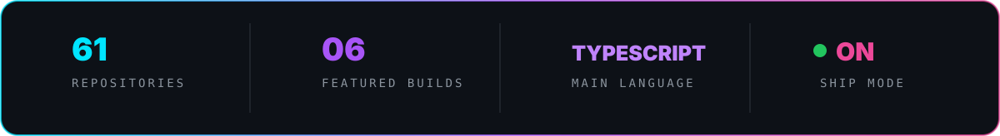

<p align="center">
  
</p>

<p align="center">
  <a href="https://zoriko.space"></a>
  <a href="https://touchpdf.space"></a>
  
</p>

<h3 align="center">I turn messy ideas and chaotic workflows into software people actually want to use.</h3>

<p align="center">
  Product engineering · polished interfaces · internal systems · PWAs · mildly unreasonable shipping speed
</p>

<br />

### `$ whoami`

```ts
const zoriko = {
  role: "full-stack product builder",
  obsession: ["clean UX", "useful systems", "shipping"],
  builds: ["SaaS", "PWAs", "internal tools", "client platforms"],
  currentStack: ["Next.js", "TypeScript", "React", "Firebase", "Supabase"],
  status: "turning coffee into production builds",
} as const;
```

### Selected transmissions

| Product | What it does | |
| :--- | :--- | :---: |
| **TouchPDF** | Privacy-first PDF toolbox with 35+ tools running entirely in the browser. | [**LAUNCH ↗**](https://touchpdf.space) |
| **Vaolt** | Shared-home finance PWA with budgets, smart settlements, reports, and offline sync. | [**LAUNCH ↗**](https://vaolt.vercel.app) |
| **Flyyngo Workspace** | Modular travel-operations ERP for leads, bookings, people, attendance, approvals, and finance. | [**LAUNCH ↗**](https://flyyngo-erp.vercel.app) |
| **Linkord** | Opinionated link-in-bio builder with live customization, auth, storage, and payments. | [**LAUNCH ↗**](https://linkcord-lol.vercel.app) |
| **Project Rocky** | A character-driven AI PWA inspired by the Eridian engineer from *Project Hail Mary*. | [**LAUNCH ↗**](https://project-rocky-seven.vercel.app) |
| **RINFRA** | Infrastructure company website backed by an authenticated lead-management CRM. | [**LAUNCH ↗**](https://rajnish-infratech.vercel.app) |

### Weapons of choice

<p align="center">
  
</p>

<p align="center">
  
</p>

<p align="center">
  
</p>
