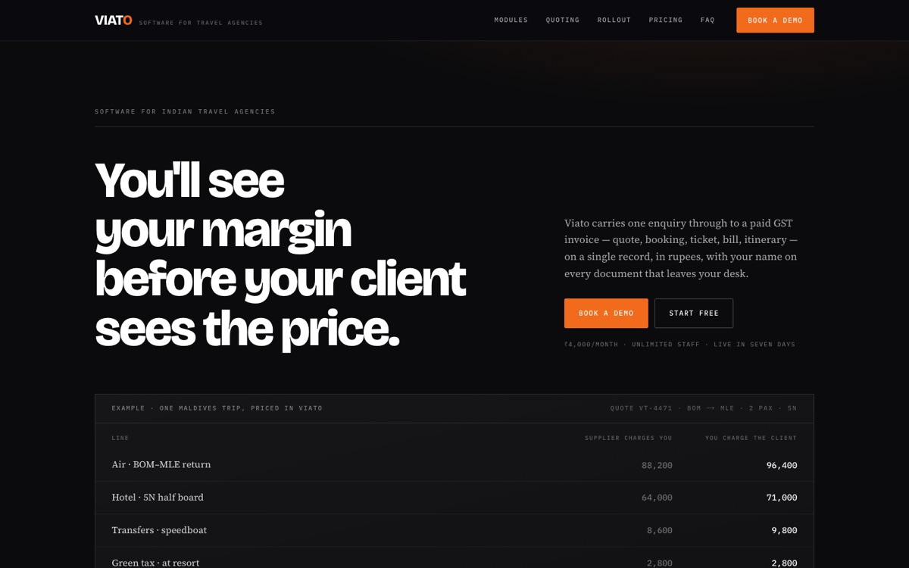
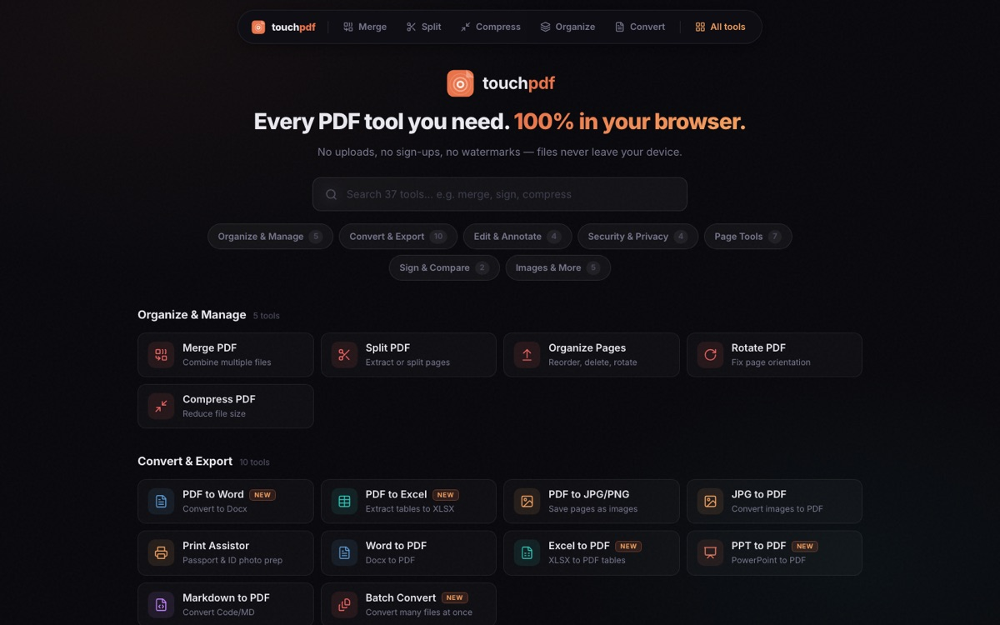
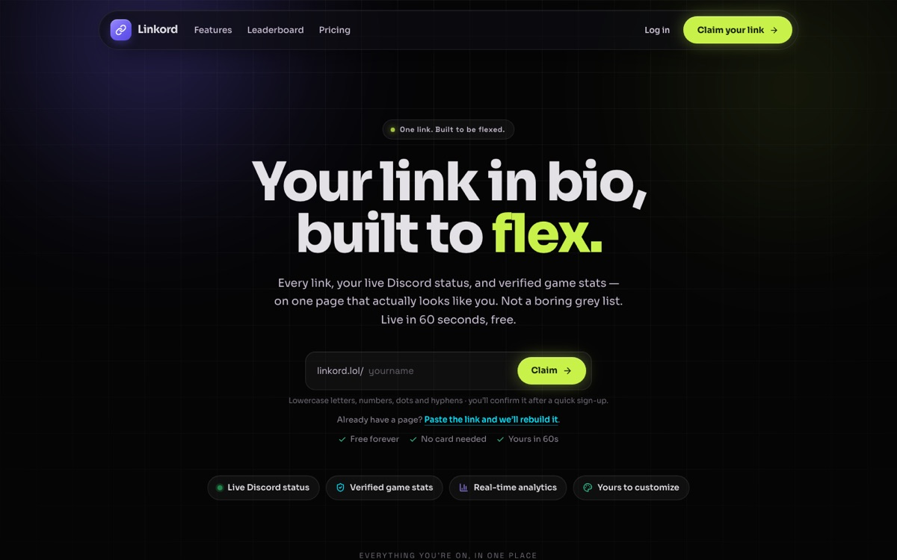
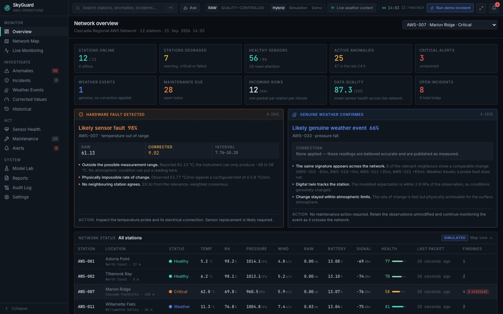
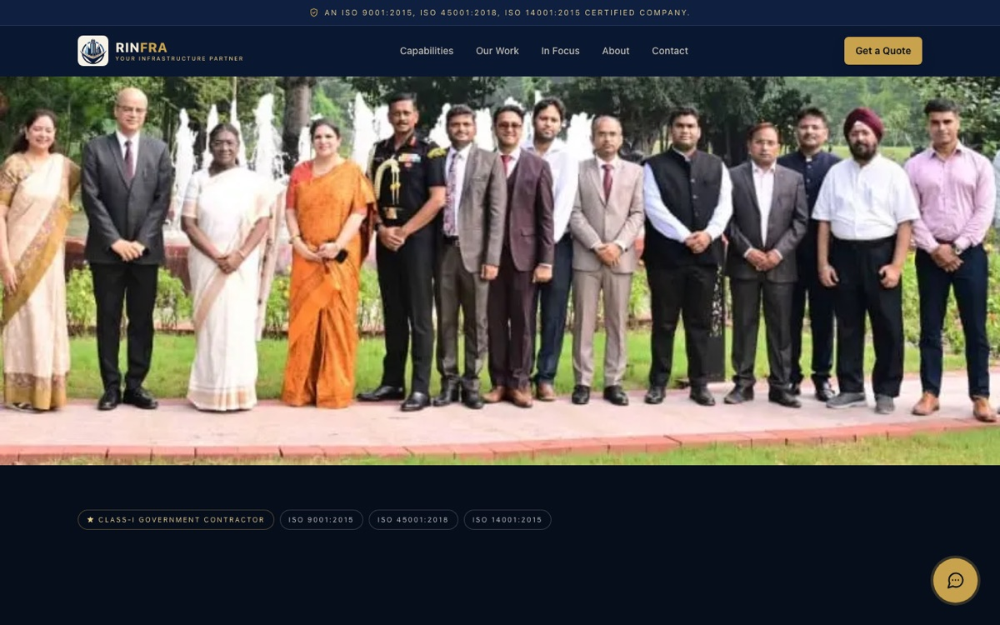
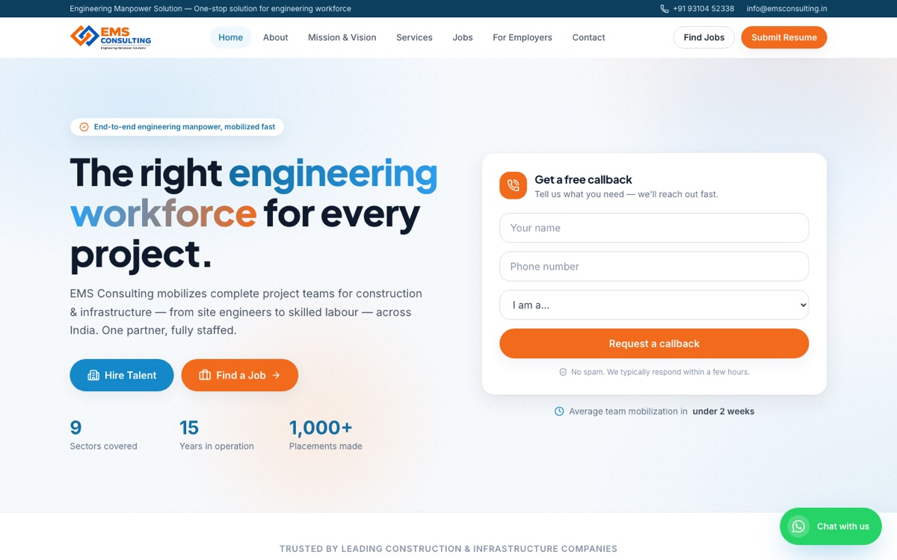

I'm Shaad Khan, a self-taught full-stack product engineer in Delhi. I started in 2018 with point-of-sale systems for small shops. Now I build ERPs for travel agencies, and I moved a nine-app platform for a travel group onto Linux servers I run myself.

Read more on [zoriko.space](https://zoriko.space), see my [résumé](https://zoriko.space/resume), or [tell me what you need built](https://zoriko.space/contact).

## Live work

<table>
  <tr>
    <td width="50%" valign="top">
      
       <b><a href="https://viato.pro">Viato</a></b>
       ERP for Indian travel agencies. One enquiry becomes a quote, booking, ticket, GST invoice and itinerary, on the same records the team uses for attendance and approvals.
    </td>
    <td width="50%" valign="top">
      
       <b><a href="https://touchpdf.space">TouchPDF</a></b>
       35+ PDF tools that run entirely in your browser. Files never leave your device, and there's no sign-up or watermark.
    </td>
  </tr>
  <tr>
    <td width="50%" valign="top">
      
       <b><a href="https://linkord.lol">Linkord</a></b>
       Link-in-bio pages for Discord communities and creators, with live Discord status, verified game stats and deep customization.
    </td>
    <td width="50%" valign="top">
      
       <b><a href="https://skyguard-zorikos-projects.vercel.app">SkyGuard</a></b>
       Data-quality platform for weather station networks. It spots anomalies, tells real weather from sensor faults, and shows the evidence. <a href="https://github.com/Zorik0/skyguard">Read the code</a>.
    </td>
  </tr>
  <tr>
    <td width="50%" valign="top">
      
       <b><a href="https://rajnishinfraprojects.com">Rajnish Infratech</a></b>
       Website and lead CRM for a Class-I government infrastructure contractor.
    </td>
    <td width="50%" valign="top">
      
       <b><a href="https://www.emsconsulting.in">Engineering Manpower Solutions</a></b>
       Hiring site for a staffing firm that supplies engineers and site teams to construction and infrastructure projects.
    </td>
  </tr>
</table>

## Also shipped

- A nine-app platform for a travel group: staff ERP, hotel property management, a customer booking PWA and the backend they share. I moved it off Firebase onto a self-hosted Linux server.
- A lead-intelligence pipeline that finds travel agencies likely to need an ERP and ranks them, with evidence for every claim.
- [Vaolt](https://vaolt.vercel.app), a PWA for roommates to share household costs, budgets and settlements.
- [ZIVO](https://zivopos.vercel.app), billing for Indian retail shops that takes UPI, cash, card and khata.
- [Project Rocky](https://project-rocky-seven.vercel.app), an AI chat app where you talk to Rocky from *Project Hail Mary*.
- Websites for [ContinualServe](https://www.continualserve.com), [Shree Ram Associate](https://www.shreeramassociate.in), [Influenzy](https://www.influenzy.in) and [ProjectSprint](https://projectsprint.store).

## Tools

I work mostly in TypeScript with Next.js and React, on Node.js, PostgreSQL, Firebase and Supabase. I deploy to Vercel or to Linux servers I manage.
